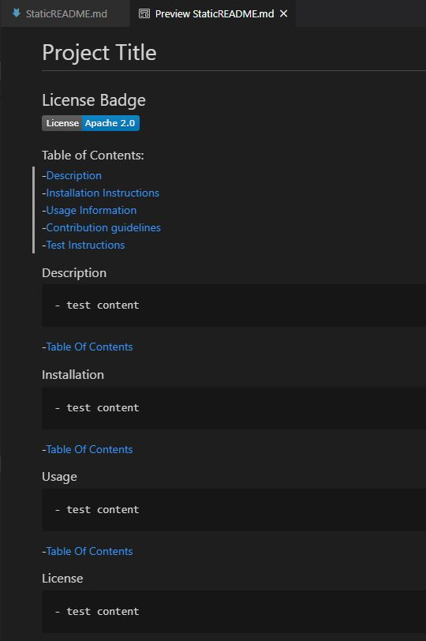
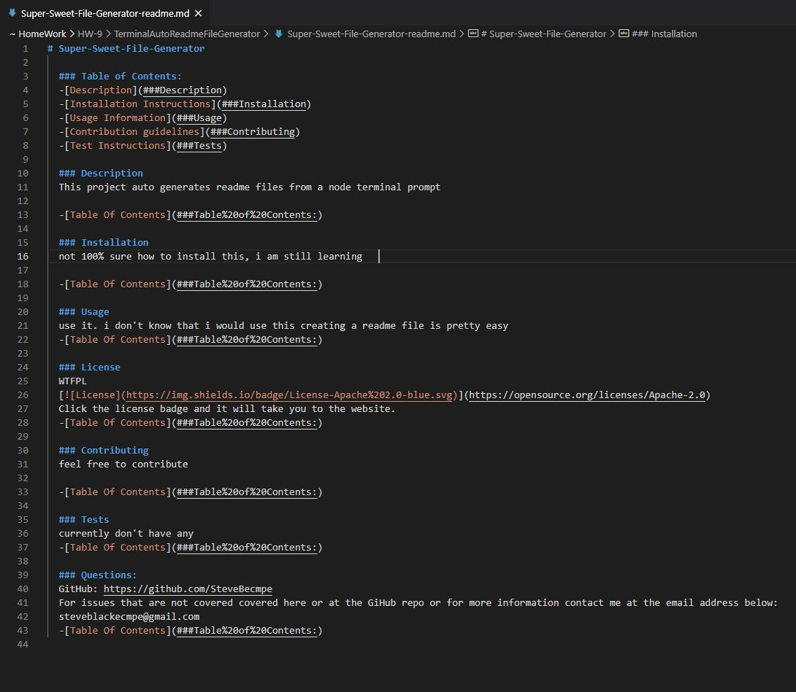
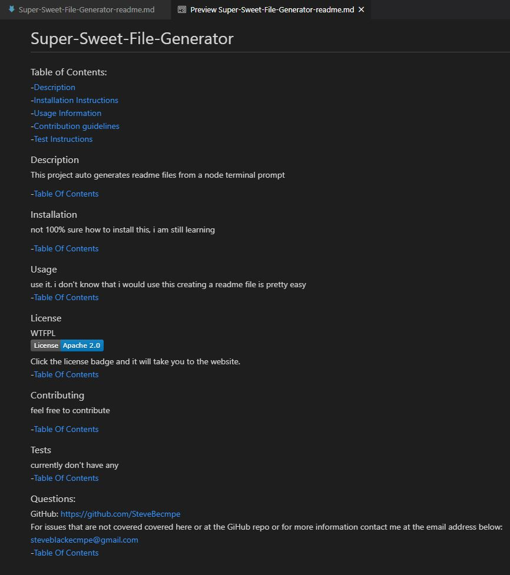

# PROJECT 09 Node.js Homework: Professional README Generator

## Link to Sample Readme file generated from program.    
Click the link to view the [Sample Readme file](./Sample-readme.md)    
Click the link to view the [Static Readme file](./StaticREADME.md)    

## Video showing running the program
NOTE: the micro phone was not working when the video was made. by the time it was fixed then Screencastify wasn't playing nice.    
This video shows the command line (terminal) syntax needed to start running the code.     
The name of the project is the first "ask". The repo contains a "Sample-readme.md". This readme was generated using this code with "Sample" as the project name.    
All sections of user specific content is filled with Lorem data. The Github user name and email are real so that the links can be tested for functionality.    
[](./Assets/VideoDemoWebmVer.webm)   
./assets/VideoDemoWebmVer.webm    
[](./Assets/VideoDemoMP4ver.mp4)    
./assets/VideoDemoMP4ver.mp4    

## Images
Originally there where table of contents links at the end of each section. This worked great in VScode but does not work in github.
Was not able to figure out how to make github do this so it was removed from the final version but shows up in the images below. 
Top half of the Static readme file to figure out style and functionality       
    
Bottom half of the Static readme file to figure out style and functionality     
    
Dynamic Readme file RAW view     
    
Dynamic Readme file VIEW mode    
    


## Creation Checklist
### [X] STEP 1: learn more about mark down language   
### [X] STEP 2: Complete "Getting Started" Section  

	-[X] Create a `.gitignore` file and include `node_modules/` and `.DS_Store/` so that your `node_modules` directory isn't tracked or uploaded to GitHub. Be sure to create your `.gitignore` file before installing any npm dependencies.

	-[X] Make sure that your repo includes a `package.json` with the required dependencies. You can create one by running `npm init` when you first set up the project, before installing any dependencies.

### [X] create script.js file  
### [X] setup command prompt input questions variables etc., required inputs:  
	-[X] project title  
	-[X] description   
	-[X] installation instructions  
	-[X] usage information  
	-[X] contribution guidelines  
	-[X] test instructions  
	-[X] choose license from list of options. CHECK BOX  
	-[X] GitHub Username
	-[X] email address  
### [X] build static readme file based off input information and desired style  
	-[X] project title,this is displayed as the title of the README  
	-[X] description, installation instructions, usage information, contribution guidelines,test instructions: this information is added to the sections of the README entitled Description, Installation, Usage, Contributing, and Tests  
	-[X] choose license from list of options. CHECK BOX: a badge for that license is added near the top of the README and a notice is added to the section of the README entitled License that explains which license the application is covered under  
	-[X] GitHub Username:this is added to the section of the README entitled Questions, with a link to my GitHub profile  
	-[X] email address:this is added to the section of the README entitled Questions, with instructions on how to reach me with additional questions  
	-[X] Table Of Contents as clickable links that navigate to the corresponding section of the README  
### [X] build dynamic version of static version  
	-[X] make the .md file create in proper location with proper name
	-[X] add static content into dynamic render "ADD FANCY WORDS HERE" Literal operator or something.
	-[X] double check all deliverables from static file:
	-[X] project title,this is displayed as the title of the README  
	-[X] description, installation instructions, usage information, contribution guidelines,test instructions: this information is added to the sections of the README entitled Description, Installation, Usage, Contributing, and Tests  
	-[X] choose license from list of options. CHECK BOX: a badge for that license is added near the top of the README and a notice is added to the section of the README entitled License that explains which license the application is covered under  
	-[X] GitHub Username:this is added to the section of the README entitled Questions, with a link to my GitHub profile  
	-[X] email address:this is added to the section of the README entitled Questions, with instructions on how to reach me with additional questions  
	-[X] Table Of Contents as clickable links that navigate to the corresponding section of the README

## Deliverables Checklist

[X] A "SampleREADME.md" generated using the application must be submitted. <br>
[X] Your GitHub repository containing your application code.<br>
[X] A walkthrough video that demonstrates the functionality of the README generator must be submitted, and a link to the video should be included in your README file.<br>
-[X] The walkthrough video must demonstrate how a user would invoke the application from the command line.<br>
-[X] The walkthrough video must demonstrate how a user would enter responses to all of the prompts in the application.<br>
-[X] The walkthrough video must demonstrate a generated README that matches the user input and has a functioning table of contents.<br>
[X] Uses the [Inquirer package](https://www.npmjs.com/package/inquirer).<br>
[X] Repository has a unique name.<br>
[X] Repository follows best practices for file structure and naming conventions.<br>
[X] Repository follows best practices for class/id naming conventions, indentation, quality comments, etc.<br>
[X] Repository contains multiple descriptive commit messages.<br>
[X] Repository contains a high-quality README with description and a link to walkthrough video.<br>
## Submit
[X] A walkthrough video demonstrating the functionality of the application.<br>
[X] A sample README.md file for a project repository generated using your application<br>
[X] The URL of the GitHub repository, with a unique name and a README describing the project<br>

## Links
* [Node.js](https://nodejs.org)
* [markdown-it](https://www.npmjs.com/package/markdown-it)
* [tasks.json](/docs/editor/tasks)


## Contributions and References:
* license badge information was found at https://gist.github.com/lukas-h/2a5d00690736b4c3a7ba    
-[Lukas Himsel](https://gist.github.com/lukas-h)   


# Given Requirements
# 09 Node.js Homework: Professional README Generator

## Your Task

When creating an open source project on GitHub, it’s important to have a high-quality README for the app. This should include what the app is for, how to use the app, how to install it, how to report issues, and how to make contributions&mdash;this last part increases the likelihood that other developers will contribute to the success of the project. 

You can quickly and easily create a README file by using a command-line application to generate one. This allows the project creator to devote more time to working on the project.

Your task is to create a command-line application that dynamically generates a professional README.md file from a user's input using the [Inquirer package](https://www.npmjs.com/package/inquirer). Review the [Good README Guide](../../01-HTML-Git-CSS/04-Important/Good-README-Guide/README.md) as a reminder of everything that a high-quality, professional README should contain. 

The application will be invoked by using the following command:

```bash
node index.js
```

Because this application won’t be deployed, you’ll also need to provide a link to a walkthrough video that demonstrates its functionality. Revisit the Screencastify Tutorial in the prework as a refresher on how to record video from your computer. You’ll need to submit a link to the video _and_ add it to the README of your project.


## User Story

```md
AS A developer
I WANT a README generator
SO THAT I can quickly create a professional README for a new project
```

## Acceptance Criteria

```md
GIVEN a command-line application that accepts user input
WHEN I am prompted for information about my application repository
THEN a high-quality, professional README.md is generated with the title of my project and sections entitled Description, Table of Contents, Installation, Usage, License, Contributing, Tests, and Questions
WHEN I enter my project title
THEN this is displayed as the title of the README
WHEN I enter a description, installation instructions, usage information, contribution guidelines, and test instructions
THEN this information is added to the sections of the README entitled Description, Installation, Usage, Contributing, and Tests
WHEN I choose a license for my application from a list of options
THEN a badge for that license is added near the top of the README and a notice is added to the section of the README entitled License that explains which license the application is covered under
WHEN I enter my GitHub username
THEN this is added to the section of the README entitled Questions, with a link to my GitHub profile
WHEN I enter my email address
THEN this is added to the section of the README entitled Questions, with instructions on how to reach me with additional questions
WHEN I click on the links in the Table of Contents
THEN I am taken to the corresponding section of the README
```

## Getting Started

Here are some guidelines to help you get started:

* Create a `.gitignore` file and include `node_modules/` and `.DS_Store/` so that your `node_modules` directory isn't tracked or uploaded to GitHub. Be sure to create your `.gitignore` file before installing any npm dependencies.

* Make sure that your repo includes a `package.json` with the required dependencies. You can create one by running `npm init` when you first set up the project, before installing any dependencies.

* Include a video of the typical user flow through your application. This includes views of the prompts and the responses after their selection.

* Include any other screenshots you deem necessary to help someone who has never been introduced to your application understand the purpose and function of it. This is how you will communicate to potential employers or other developers in the future what you built and why, and to show how it works.

## Grading Requirements

This homework is graded based on the following criteria: 

### Deliverables: 20%

* A sample README generated using the application must be submitted.

* Your GitHub repository containing your application code.

### Walkthrough Video: 27%

* A walkthrough video that demonstrates the functionality of the README generator must be submitted, and a link to the video should be included in your README file.

* The walkthrough video must demonstrate how a user would invoke the application from the command line.

* The walkthrough video must demonstrate how a user would enter responses to all of the prompts in the application.

* The walkthrough video must demonstrate a generated README that matches the user input and has a functioning table of contents.

### Technical Acceptance Criteria: 40%

* Satisfies all of the above acceptance criteria plus the following:

	* Uses the [Inquirer package](https://www.npmjs.com/package/inquirer).

### Repository Quality: 13%

* Repository has a unique name.

* Repository follows best practices for file structure and naming conventions.

* Repository follows best practices for class/id naming conventions, indentation, quality comments, etc.

* Repository contains multiple descriptive commit messages.

* Repository contains a high-quality README with description and a link to walkthrough video.


## Review

You are required to submit the following for review:

* A walkthrough video demonstrating the functionality of the application.

* A sample README.md file for a project repository generated using your application

* The URL of the GitHub repository, with a unique name and a README describing the project

---

© 2021 Trilogy Education Services, LLC, a 2U, Inc. brand. Confidential and Proprietary. All Rights Reserved.
